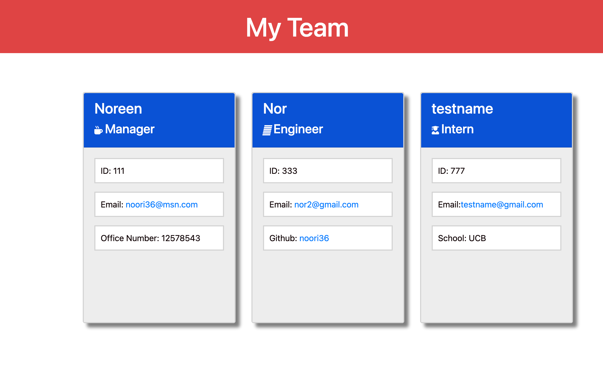

# Team Profile Generator

A command-line application that takes in information about employees on a software engineering team and generates an HTML webpage that displays summaries for each person.
  
 ## User Story
```md
AS A manager
I WANT to generate a webpage that displays my team's basic info
SO THAT I have quick access to their emails and GitHub profiles
```

 
  ## Table of Contents

  1. [Installation](#installation)
  1. [Usage](#usgae)
  3. [Contributing](#contributing)
  4. [Testing](#testing)
  4. [Authors](#authors%20and%20acknowledgment)
  5. [License](#license)


  ## Installation:
  ```
  1- Install node.js  
  2- Install inquirer
  3- git clone URL OF THE REPO
  4- From terminal run “node index.js”
  ``` 


  ## Usage
  Create a team profile.
  
  - Screenshot
  <br>

  
  - <a href="https://drive.google.com/file/d/1frPcKCF6me5XFSVb4NPXX92wk84tJtm-/view?usp=sharing"> Walkthrough Video</a>
    
  - <a href="./dist/index.html">Sample Generated HTML</a>
  -   [The URL of the GitHub Repository.](https://github.com/noori36/Professional-README-Generator)
 

  ## Contributing:
  To contribute to this application:
  ```
  - Clone the repo 
  - Create a feature branch 
  - Commit your new feature 
  - Push your branch 
  - Create a new Pull Request 
  - Request a code review 
  - After approval your feature will be merged
  ```
  
  ## Testing
    Test will be run through jest. run "npm test" from commandline to run the tests.
  
  ## Authors

  Noreen A
  

## License

[MIT](https://choosealicense.com/licenses/mit/)
    
